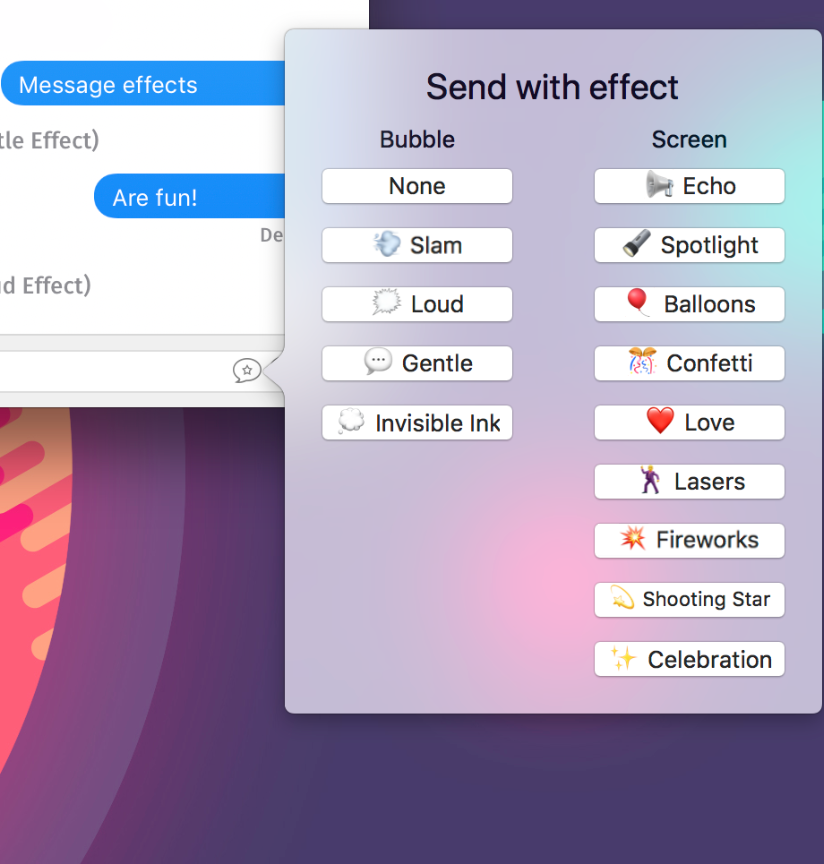

# iMessageParity

# Information:

- Designed for 10.10+
- iMessageParity is a mySIMBL plugin that allows you to send iMessages with effects on macOS
- This fork adds emojis next to the effects, and the text has been tweaked to match that of iOS.
- Author: [w0lfschild](https://github.com/w0lfschild)

# Note:

- Based off code from [iMessageParity](https://github.com/LumingYin/iMessageParity) by [LumingYin](https://github.com/LumingYin/iMessageParity)

# Installation:

1. Download [mySIMBL](https://github.com/w0lfschild/app_updates/raw/master/mySIMBL/mySIMBL_master.zip)
2. Download [iMessageParity](https://github.com/w0lfschild/iMessageParity/raw/master/build/iMessageParity.bundle.zip)
3. Unzip downloads
4. Open `iMessageParity.bundle` with `mySIMBL.app`
5. Open `Terminal.app` and run the command `killall Messages`
7. Open `Messages.app`

### License:
Pretty much the BSD license, just don't repackage it and call it your own please!
Also if you do make some changes, feel free to make a pull request and help make things more awesome!
